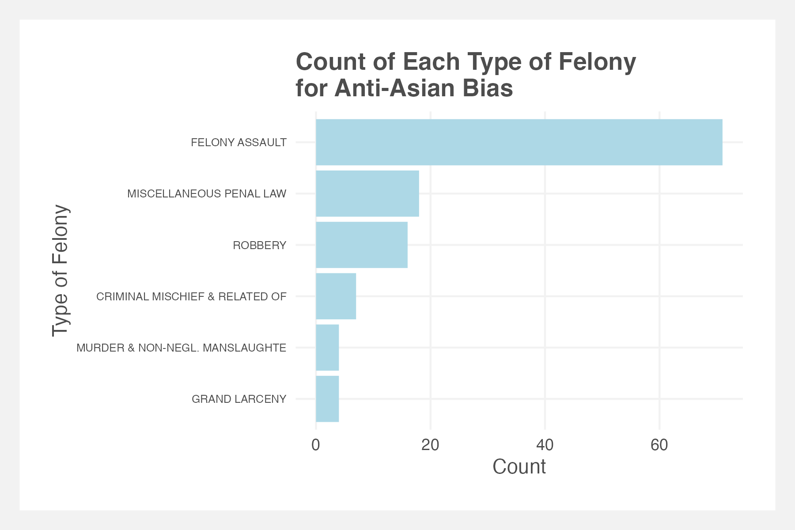

# small-business-sentiment-analysis

Data Driven Methods of Policy Evaluation group project

## Data

[Data on Google Drive](https://drive.google.com/drive/u/1/folders/1iueQxhS5ttYFrF6E2TuhFnYfAS8RS4RM)

`review_data/`

- `reviews19_20_21.RData` - all restaurant reviews for 2019, 2020 and 2021
- `restaurant_locations_by_type.csv` - asian, pizza and mexican restaurants with latitude, longitude and zip code (for plotting)
- `reviews_with_sentiment.csv` - asian and pizza restaurants with sentiment (polarity and subjectivity)
- `d_asian_1_5.RData` - contains `d_asian`, which is `reviews_1.RData` to `reviews_5.RData`, joined with `nyc_asian_restaurants.csv` (31,040 rows)
- `d_pizza_1_5.RData` - contains `d_pizza`, which is `reviews_1.RData` to `reviews_5.RData`, joined with `nyc_pizza_restaurants.csv`
- `nyc_asian_restaurant.csv` - contains Yelp details of Asian restaurants (`id, alias, name, image_url, is_closed, url, review_count, categories, rating, coordinates, transactions, price, location, phone, display_phone, distance, attributes`) determined by cuisine categorized as Chinese, Japanese, Korean, Vietnamese or Thai.
- `nyc_pizza_restaurant.csv` - contains Yelp details of pizza restaurants (`id, alias, name, image_url, is_closed, url, review_count, categories, rating, coordinates, transactions, price, location, phone, display_phone, distance, attributes`)
- `nyc_mexican_restaurant.csv` - contains Yelp details of texmex, mexican and new mexican restaurants (`id, alias, name, image_url, is_closed, url, review_count, categories, rating, coordinates, transactions, price, location, phone, display_phone, distance, attributes`)
- `SBS_Certified_Business_List_20240309.csv` - contains list of minority owned business

  - `raw_data` - folder contains `meta_New-York.json` and `review_New-York.json`
  - `review_data_split` - folder contains 100 `output_X.json` files which are constructed by splitting `meta_New-York.json` lines
  - `reviews` - folder contains 20 `reviews_X.RData` files which are constructed from `output_X.json`, and only contains 4 columns per review (`time, rating, text, gmap_id`)
